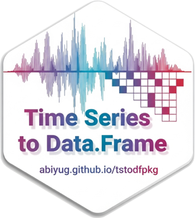
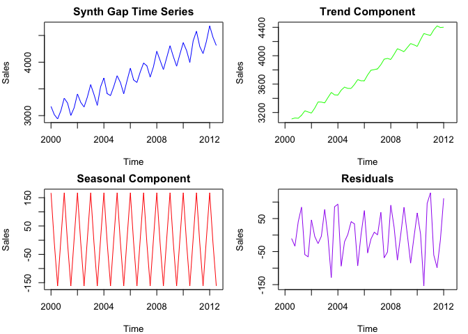

# tstodfpkg 

## Introduction `tstodfpkg` R package
 A lightweight R package designed to simplify the conversion of time series (`ts`) objects into structured `data.frame` objects,  and enhancing data analysis workflows. This package includes a versatile `ts_to_df` function and a synthetic dataset, `synth_gap`, to demonstrate its capabilities. Built with base R tools, it ensures broad compatibility and ease of use for R users.
  - **`ts_to_df` Function**: Transforms any `ts` object into a `data.frame` with columns for `Year`, `Period`, and the time series values, adaptable to various frequencies (e.g., quarterly, monthly, multivariate ts ).
  - **`synth_gap` Dataset**: A synthetic quarterly time series mimicking the `gap` dataset from the `UsingR` package, featuring a trend, seasonality, and noise, ideal for testing and examples.
 
 ## Installation

 Install the package from GitHub:


```r
install.packages("remotes")

#with out vignette
remotes::install_github("username/tstodfpkg")

# with vignette
remotes::install_github("username/tstodfpkg", build_vignettes = TRUE)
```
  
## Usage

 Load the package and use the `ts_to_df` function to convert a time series to a data frame:

### **Example 1 (Quarter Period)**

```r
library(tstodfpkg)
data(synth_gap)  # Load the synthetic dataset
head(ts_to_df(synth_gap, name = "Sales"))  #Coverts ts synth_gap data to data.frame
```

```
##   Year Period    Sales
## 1 2000     Q1 3171.976
## 2 2000     Q2 3018.491
## 3 2000     Q3 2937.935
## 4 2000     Q4 3093.525
## 5 2001     Q1 3326.464
## 6 2001     Q2 3235.753
```
### Vignette
- To install the vginettes from github from R console `remotes::install_github("abiyug/tstodfpkg", build_vignettes = TRUE)` and launch it with `vignette("tstopkg-use-case", package = "tstodfpkg)`


## Key features include:

- **Input Flexibility**: Accepts any `ts` object, whether univariate or multivariate, with automatic detection of frequency (e.g., 4 for quarterly, 12 for monthly).
- **Output Structure**: Returns a `data.frame` with:
  - `Year`: The integer year extracted from the time index.
  - `Period`: A label based on frequency (e.g., "Q1" for quarterly, "Jan" for monthly using `month.abb`, or numeric for other frequencies).
  - Value column(s): Named according to the `name` parameter (default "Value") for univariate series, or retaining original names for multivariate series.
- **Customization**: The `name` argument allows users to specify the value column name (e.g., "Sales"), enhancing readability for specific use cases.
- **Monthly Support**: For monthly data (`freq == 12`), it generates period labels like "Jan", "Feb", etc., using `month.abb`. 
- **Compatibility**: Designed to work across R versions 3.0.0 to 4.5.1 (tested on 3.5.0), using only base R functions for maximum portability.

### **Example 2 (Month Period)**

```r
  monthly_ts <- ts(rnorm(24), start = c(2020, 1), frequency = 12)
  head(ts_to_df(monthly_ts, name = "Temp")) 
```

```
##   Year Period       Temp
## 1 2020    Jan  0.8779896
## 2 2020    Jan  0.3826979
## 3 2020    Mar  1.0672027
## 4 2020    Apr  0.8557723
## 5 2020    Apr -1.1447983
## 6 2020    Jun -0.9114639
```

### **Example 3 (Create a multivariate ts)**

```r
multi_ts <- ts(matrix(rnorm(8), ncol = 2), start = c(2000, 1), frequency = 4)
head(ts_to_df(multi_ts))  
```

```
##   Year Period   Series.1   Series.2
## 1 2000     Q1  1.3906166  1.5680442
## 2 2000     Q2 -0.5297045 -0.1980581
## 3 2000     Q3  0.7835636 -0.5566617
## 4 2000     Q4  0.3738937 -0.2052227
```

### Brief Time Series Overview
A time series (`ts`) in R is a data structure for storing ordered data points over time, commonly used for analysis and forecasting. The example plots generated from `synth_gap`—including trend, seasonality, and residuals—demonstrate its potential for identifying patterns and anomalies, aiding in data-driven decisions.



## Additional Tips for Installing and Using tstodfpkg

To ensure a smooth installation and access to the package vignette, follow these recommendations:

- **Set Up a GitHub Personal Access Token (PAT)**: If you encounter an HTTP 401 authentication error during installation, create and set a GitHub PAT:
```r
  install.packages("gitcreds")
  gitcreds::gitcreds_set()  # Paste your ghp_xxx PAT when prompted
```
  To create a PAT, visit `https://github.com/settings/tokens/new` and select the `repo` scope.

- **Access the Vignette**: After installation, view the vignette in PDF or HTML format:
 ```r
  # For PDF (default)
  vignette("tstodfpkg-use-case", package = "tstodfpkg")
  # For HTML
  browseURL(system.file("doc", "tstodfpkg-use-case.html", package = "tstodfpkg"))
 ```

- **Install Vignette Dependencies**: Ensure the following packages are installed for proper vignette rendering:
```r
  install.packages(c("knitr", "rmarkdown"))
```

## Compatibility
  - Supports R versions 3.0.0 to 4.5.1 (tested on 3.5.0).

## License
 MIT

## Contributing
 Feel free to submit issues or pull requests on [GitHub](https://github.com/abiyug/tstodfpkg).


